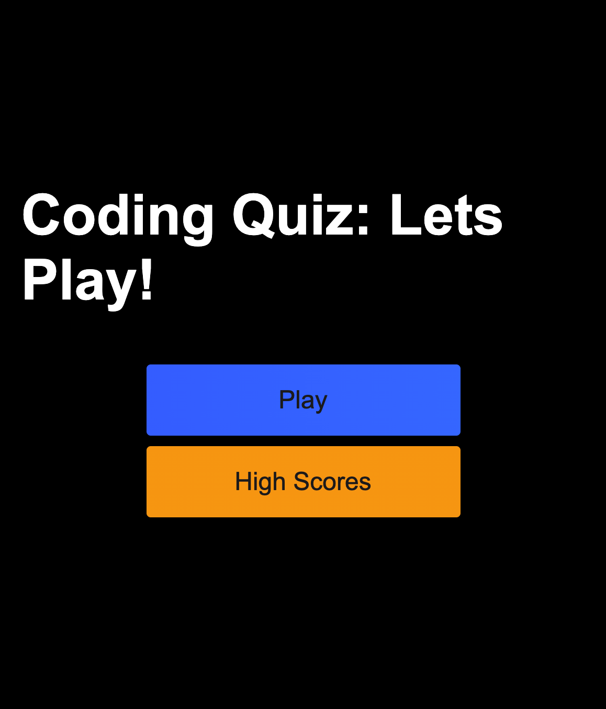
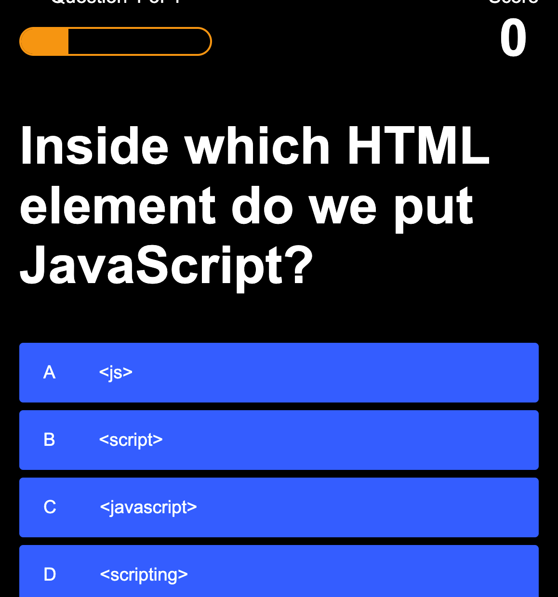
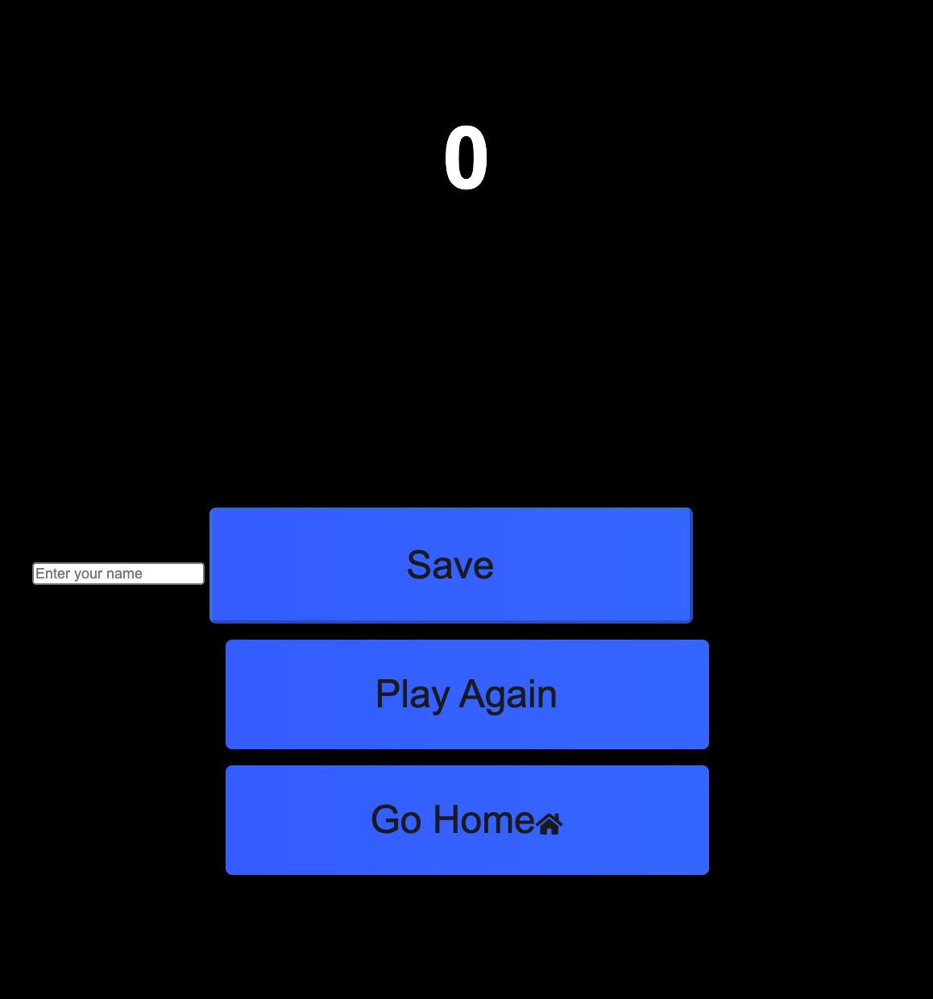

# Code-Quiz

For this project the objective was to build a JavaScript Code Quiz that contains the following:

1. Instructions on how to play.
3. Click Play to answer multiple choice questions. Green means answer is correct and Red means incorrect answer.
4. Each question is worth 100 points. 400 points possible.
5. Once quiz ends user enters in name and can save.
6. User can view highscores on homepage

Click link to play code quiz: 

